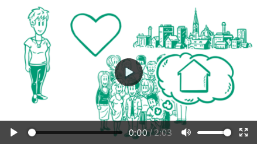

> # [Förderprogramm "Heimat. Zukunft. Nordrhein-Westfalen. Wir fördern, was Menschen verbindet."](https://www.mhkbg.nrw/themen/heimat/heimat-foerderprogramm)
> "Heimat. Zukunft. Nordrhein-Westfalen. – Wir fördern was Menschen verbindet“: Fünf Förderelemente - 150 Millionen Euro bis 2022.
> 
> 
> ©iStock.com/monkeybusinessimages
> 
> 
> 
> „Heimat. Zukunft. Nordrhein-Westfalen. Wir fördern, was Menschen verbindet.“ So hat das Ministerium für Heimat, Kommunales, Bau und Gleichstellung des Landes Nordrhein-Westfalen das Landesförderprogramm zur Förderung und Stärkung unserer vielfältigen Heimat in Nordrhein-Westfalen überschrieben.
> 
> Heimat ist Lebensqualität und schafft Verbundenheit in Zeiten, wo uns Vieles zu trennen scheint. Die Landesregierung fördert Initiativen und Projekte, die lokale und regionale Identität und Gemeinschaft und damit Heimat stärken. Ziel ist es, Menschen für lokale und regionale Besonderheiten zu begeistern und die positiv gelebte Vielfalt in unserem Bundesland deutlich sichtbar werden zu lassen.
> 
> Mit den fünf Elementen Heimat-Scheck, Heimat-Preis, Heimat-Werkstatt, Heimat-Fonds und Heimat-Zeugnis fördert die Landesregierung mit rund 150 Millionen Euro bis 2022 die Gestaltung der Heimat vor Ort, in Städten und Gemeinden und in den Regionen. Eine Antragsstellung ist möglich. Die dazu benötigten Formulare finden Sie bei der Vorstellung der jeweiligen Förderelemente auf dieser Seite.
> 
> > "Tagtäglich setzen sich in unserem Land ehrenamtliche Frauen und Männer für den Erhalt von Traditionen, für die Pflege des Brauchtums, für die Erhaltung und Stärkung des regionalen Erbes und der Vielfalt ein. Sie stärken mit ihrem Engagement unsere Gesellschaft und die Gemeinschaft in vielfältiger Art und Weise. Sie tragen dazu bei, dass unsere Traditionen und Werte bewahrt und nach vorne entwickelt werden und sie geben diese an die nächste Generation weiter."
> 
> **Ministerin Ina Scharrenbach zum Heimat-Förderprogramm**
> 
> #### Weitere Informationen
> - [Häufig gestellte Fragen und Antworten zum Heimatförderprogramm (PDF, 1,11 MB)](https://www.mhkbg.nrw/sites/default/files/media/document/file/FAQ%20Heimat%2011.09.2020_0.pdf)
> 
> ## Heimat-Scheck - der Möglichmacher
> 
> Diese Situation kennt jede und jeder ehrenamtlich Tätige: Man hat eine kleine, aber feine, häufig spontane Idee, für deren Realisierung es eines überschaubaren Zuschusses bedarf.
> 
> Neben der Finanzierungsfrage steht dem Projekt höchstens noch Bürokratie im Weg: Schwierige Antragsverfahren mit hohen Hürden und lähmenden Vorlauf und aufwendige Abrechnungsprozeduren nach der Durchführung.
> 
> Hier setzt der „Heimat-Scheck“ an: Er ist der Möglichmacher für all solch gute Ideen und kleinen Projekte, die eigentlich gar nicht viel Geld kosten, aber einen großen Mehrwert in der Sache versprechen. Antrag und Verwendungsnachweis sind auf ein Minimum reduziert.
> 
> Die Landesregierung Nordrhein-Westfalen will jährlich 1.000 Projekte mit jeweils 2.000 Euro fördern: Sie sind die Wertschätzung für die grenzenlose Vielzahl von kleinen Initiativen und Projektideen, ohne die unsere Gemeinschaft ein großes Stück ärmer und eintöniger wäre.
> 
> #### Weitere Informationen
> - [Förderrichtlinie "Heimat-Scheck" (Webseite)](https://recht.nrw.de/lmi/owa/br_vbl_detail_text?anw_nr=7&vd_id=17195&ver=8&val=17195&sg=0&menu=1&vd_back=N)
> - [Förderung "Heimat-Scheck" online beantragen (Webseite)](https://www.heimatfoerderung.nrw/onlineantrag)
> - [Häufig gestellte Fragen und Antworten zum Heimatförderprogramm (PDF, 1,14 MB)](https://mhkbg.nrw/sites/default/files/media/document/file/FAQ%20Heimat%2011.09.2020_0.pdf)
> - [Vordruck Verwendungsnachweis Heimat-Scheck (PDF, 562,41 KB)](https://www.mhkbg.nrw/sites/default/files/media/document/file/Scheck-Verwendungsnachweis.pdf)
> 
> ## Heimat-Scheck und Heimat-Preis kurz erklärt
> 
> 
> **Video**
> 
> Heimat-Scheck: Der Möglichmacher  
> 01:25 Minuten
> 
> ---

[Abgerufen am 30. Dezember 2020](https://www.mhkbg.nrw/themen/heimat/heimat-foerderprogramm 'Förderprogramm "Heimat. Zukunft. Nordrhein-Westfalen. Wir fördern, was Menschen verbindet."')

## Lizenzierung
Die Unterlagen zur Beantragung dieser Förderung sind unter der [CC0 1.0 Universell Public Domain Dedication](https://creativecommons.org/publicdomain/zero/1.0/) lizenziert.

