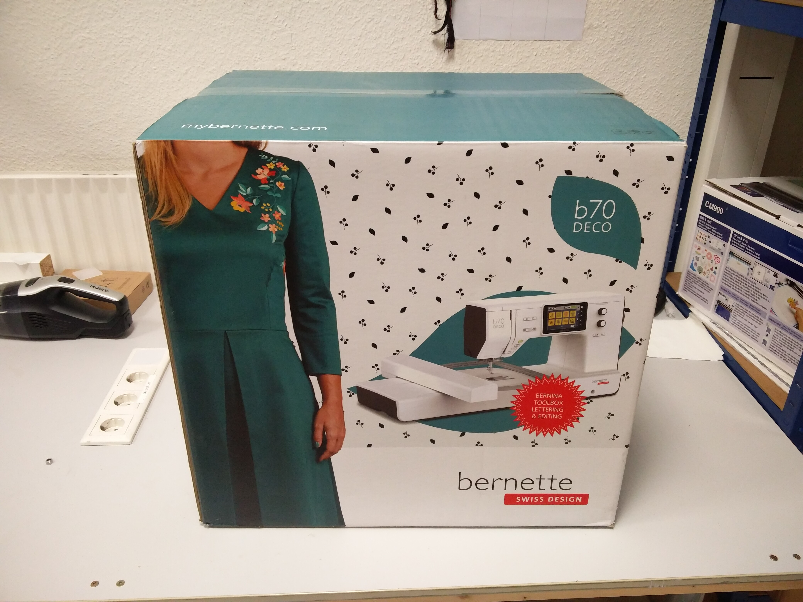
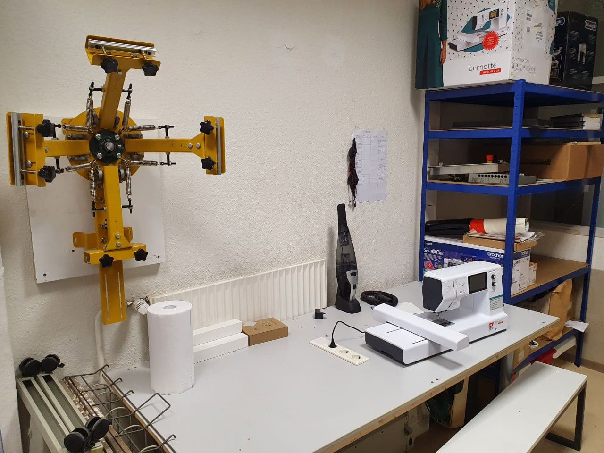
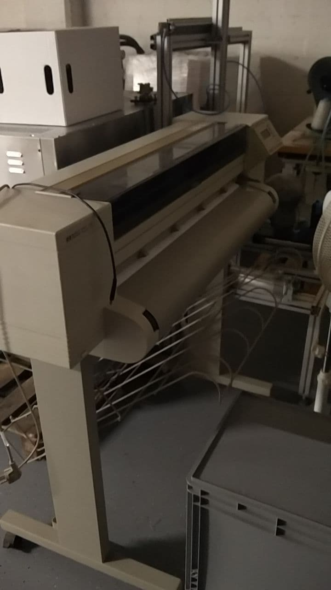

# 1. Zuwendungsempfänger
#### Bezeichnung des Antragstellers
Makerspace Gütersloh e.V.

#### Anrede
Verein

#### Titel

#### Vorname / Name 1
Makerspace Gütersloh e.V.

#### Nachname / Name 2
c/o Die WEBEREI – Bürgerkiez gGmbH

#### Straße / Nr.
Bogenstraße 1-8

### PLZ
33330

#### Ort
Gütersloh

#### Postfach

#### PLZ Postfach

#### Ort Postfach

#### Telefon
05241-2249910

#### Fax

#### E-Mail
info@makerspace-gt.de

#### DE-Mail

#### IBAN
DE52 4786 0125 1226 2315 00

# 2. Vertretungsberechtigter
#### Anrede
Herr

#### Titel

#### Vorname / Name 1
Michael

#### Nachname / Name 2
Prange

#### Organ / Vertretungsart
Vorstand

#### Straße / Nr.
Bogenstraße 1-8

### PLZ
33330

#### Ort
Gütersloh

#### Telefon
05241-2249910

#### Fax

#### E-Mail
michael@makerspace-gt.de

#### DE-Mail

# 3. Maßnahmenangaben
#### Betreff
Verwendungsnachweis zur Maßnahme Einrichtung einer öffentlichen Textilwerkstatt - neue Weberei

#### Position
1.1 Heimat-Scheck

#### Bewilligung vom
29.04.2020

#### AZ
35.12.01.001/2020-GT-016

#### Über
2.000,00 €

#### Insgesamt bewilligt
2.000,00 €

#### Es wurden ausgezahlt insges.
2.000,00 €

# 4. Sachbericht

1. Die durchgeführte Maßnahme ist unter anderem mit Beginn, Dauer, Abschluss, Erfolg und Auswirkungen der Maßnahme kurz darzustellen. Gegebenenfalls können auch Videos, Fotos oder ähnliche Darstellungen beigefügt oder auf deren Fundstelle hingewiesen werden.
2. Bestätigung, dass die Maßnahmen entsprechend dem Zuwendungsantrag und dem Zuwendungsbescheid durchgeführt worden sind, und zwar in Bezug auf die zu Grunde liegenden Planungen, die Qualität und die Standards. Wesentliche Abweichungen sind im Detail in vergleichender Darstellung (Antrag sowie tatsächliche Ausführung) zu beschreiben.
3. Bestätigung, dass zuwendungsfähige Ausgaben mindestens in Höhe des Finanzierungsplanes des Zuwendungsantrags und des Zuwendungsbescheids entstanden sind.

#### Sachbericht
[Siehe Anlage "Sachbericht.pdf".](Sachbericht.md)

# 5. Zahlenmäßiger Nachweis
|  Nr.  | Leistendes Unternehmen | Art der Leistung        | Zahldatum  | Betrag in EUR |
| :---: | :--------------------- | :---------------------- | :--------: | ------------: |
|   1   | Nähmaschinen Handwerk  | Bernette Nähmaschine    | 06.07.2020 |      410,00 € |
|   2   | Nähmaschinen Handwerk  | Privileg Kettelmaschine | 06.07.2020 |        0,00 € |
|   3   | Amazon                 | Overlockgarn, weiß      | 10.06.2020 |       13,99 € |
|   4   | Amazon                 | Overlockgarn, schwarz   | 10.06.2020 |       13,99 € |
|   5   | Nähmaschinen Handwerk  | Bernette Stickmaschine  | 06.07.2020 |      919,87 € |
|   6   | Amazon                 | Stickvlies              | 05.06.2020 |       26,87 € |
|   7   | Amazon                 | Stickgarn               | 09.06.2020 |       45,99 € |
|   8   | Siebdruckversand       | Siebdruck-Set           | 05.06.2020 |      440,68 € |
|   9   | Artur Diederich        | Brother Schneideplotter | 04.06.2020 |      399,00 € |
|  10   | Amazon                 | Transferpapier          | 08.06.2020 |       24,99 € |
|  11   | Amazon                 | Mini Dampf Bügeleisen   | 04.06.2020 |       34,90 € |
|  12   | Amazon                 | Ärmelbügelbrett         | 09.06.2020 |       14,99 € |

|                                                                |            |
| -------------------------------------------------------------: | ---------: |
|                                             Summe Gesamtkosten | 2.345,27 € |
|                        abzgl. Einnahmen und Leistungen dritter |     0,00 € |
|                                Zuwendungsfähige Gesamtausgaben | 2.345,27 € |
|                                                   Förderbetrag | 2.000,00 € |
| verbleibender Eigenanteil (oder gegebenenfalls Rückzahlbetrag) |   345,27 € |

#### Ist die Ausgabesumme niedriger als der Förderbetrag, so sind die Gründe der Ausgabenveränderung darzustellen. Der Differenzbetrag ist zudem umgehend zurückzuzahlen.

# 6. Bestätigungen
Es wird bestätigt, dass...

- [x] die Allgemeinen und Besonderen Nebenbestimmungen des Zuwendungsbescheides beachtet wurden,
- [x] die Ausgaben notwendig waren, wirtschaftlich und sparsam verfahren worden ist und die Angaben im Verwendungsnachweis mit den Büchern und Belegen übereinstimmen,
- [x] für die Durchführung der Maßnahme keine weitere Förderung von Dritten gewährt wurde oder noch gewährt wird,
- [x] die Originalbelege für die Dauer von fünf Kalenderjahren nach Vorlage dieses Verwendungsnachweises für Prüfzwecke vorgehalten werden und

die Antragstellerin oder der Antragsteller zum Vorsteuerabzug:

- [x] nicht berechtigt beziehungsweise
- [ ] berechtigt ist und dies bei der Berechnung der Ausgaben berücksichtigt hat.

# 7. Dokumentenupload
Es können noch 2 Dokument(e) hochgeladen werden.

| Bezeichnung     | Name                                                                                |                                                                 |
| :-------------- | :---------------------------------------------------------------------------------- | --------------------------------------------------------------- |
| Nähmaschine     | [942aca5eef47792e3660eccb311a35f4.jpg](images/942aca5eef47792e3660eccb311a35f4.jpg) |      |
| Kettelmaschine  | [5fc00d85d1fe296c1a23d1cb0f420e92.jpg](images/5fc00d85d1fe296c1a23d1cb0f420e92.jpg) |   |
| Stickmaschine   | [ffb22311ff03bb7ee216676503f8b6f0.jpg](images/ffb22311ff03bb7ee216676503f8b6f0.jpg) |    |
| Siebdruck Set   | [161fcaa958c55e308cd3c3bb859b2d88.jpg](images/161fcaa958c55e308cd3c3bb859b2d88.jpg) |    |
| Plotter         | [f518e6ea4a458105b83bfe05a4a7a11e.jpg](images/f518e6ea4a458105b83bfe05a4a7a11e.jpg) |          |
| Bügeleisen      | [b829337a9df37b5e1effbae42eac1407.jpg](images/b829337a9df37b5e1effbae42eac1407.jpg) |       |
| Textilwerkstatt | [38cbd94579c53078752114aafeb1c6e2.jpg](images/38cbd94579c53078752114aafeb1c6e2.jpg) |  |
| A0-Drucker      | [001515c2a89d99e865b331ae957fde04.jpg](images/001515c2a89d99e865b331ae957fde04.jpg) |       |
| Sachbericht     | [Sachbericht.pdf](Sachbericht.md)                                                  |                                                                 |
